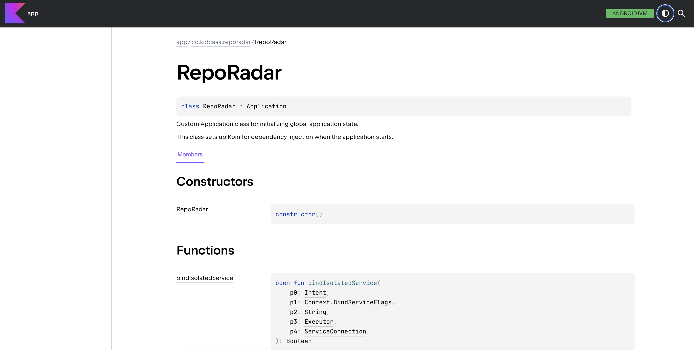

# RepoRadar
RepoRadar is a 100% compose-based Android app that displays a list of the 100 most
starred Github repositories.

## Software Requirements
- [x] Maximum of three hours of development time.
- [x] Use the GitHub REST API to display a list of the 100 most
  starred Github repositories using `GET https://api.github.com/search/repositories?q=stars:>0`.
- [x] For each of the repositories, also display its top contributor.
- [x] To get the list of contributors for a given repository, use: `GET https://api.github.com/repos/{owner}/{repo}/contributors`
- [x] Use the provided OAuth2 token to avoid Github’s API rate limiting, but do not publish it.
- [x] Write your code in Kotlin, Java, or both.
- [x] Add any instructions in a README.
- [x] Handle any unique constraints and to-be-expected
  circumstances on a mobile device.

## Getting Started
To get started create the `apikeys.properties` at root level of the project and enter the value for `github.token=`  
Please note, the token in the project instructions don't work, you'll have to create your own in the Github Developer Settings.

## Documentation
This Android app has comprehensive documentation generated with [Dokka](https://github.com/Kotlin/dokka). To generate the docs, simply run `./gradlew dokkaHtml` from the root level of the project. The docs can be opened from a web browser locally from `app/build/dokka/html/index.html`.

## Architecture

## Third-party libraries
1. [Moshi](https://github.com/square/moshi) for easily parsing JSON into Kotlin classes.
2. [Koin](https://insert-koin.io/docs/quickstart/android/) for dependency injection.
3. [Retrofit](https://square.github.io/retrofit/) for HTTP requests.
4. [Coil](https://coil-kt.github.io/coil/) for image loading.

## Useful Links
1. [GitHub REST API documentation](https://docs.github.com/en/rest?apiVersion=2022-11-28)